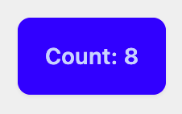

# Chrome Extension Starter

A modern Chrome extension starter template powered by **Vite**, **Svelte 5**, **TypeScript**, **TailwindCSS**, and **DaisyUI**. This template is designed for rapid development of MV3 (Manifest Version 3) extensions with a focus on performance, modularity, and modern developer tools.

---

## ✨ Features

- **[Vite](https://vite.dev/)**: Lightning-fast bundler for modern web development.
- **[Svelte 5](https://svelte.dev/docs/svelte/what-are-runes)**: Minimalistic framework for building user interfaces.
- **[TypeScript](https://www.typescriptlang.org/docs/handbook/intro.html)**: Static typing for better code quality and maintainability.
- **[TailwindCSS](https://tailwindcss.com/docs)**: Utility-first CSS framework for rapid UI development.
- **[DaisyUI](https://daisyui.com/)**: TailwindCSS-based components for faster styling.
- **[Chrome Manifest V3](https://developer.chrome.com/docs/extensions/develop/migrate/what-is-mv3)**: Secure and powerful API for Chrome extensions.

---

## 🚀 Getting Started

### Prerequisites

Before you begin, ensure you have the following installed:

- [Node.js](https://nodejs.org/) (v16 or higher)
- [npm](https://www.npmjs.com/) or [pnpm](https://pnpm.io/) (v7 or higher)
- [Google Chrome](https://www.google.com/chrome/)

---

### Installation

1. **Clone the Repository:**

   ```bash
   git clone https://github.com/your-username/chrome-extension-starter.git
   cd chrome-extension-starter
   ```

2. **Install Dependencies:**

   Using npm:

   ```bash
   npm install
   ```

   Or using pnpm:

   ```bash
   pnpm install
   ```

3. **Run Development Server:**

   ```bash
   npm run dev
   ```

   This will start the Vite dev server for live reloading and hot module replacement (HMR). The extension will be pre-rendered for Chrome MV3 development.

4. **Build for Production:**

   ```bash
   npm run build
   ```

   The production-ready extension will be output to the `dist/` directory.

---

### Load the Extension in Chrome

1. Open `chrome://extensions` in your browser.
2. Enable **Developer Mode** (toggle in the top-right corner).
3. Click **Load unpacked** and select the `dist/` folder generated by the build process.

---

## 🛠️ Project Structure

```
.
├── public/                 # Static assets (manifest.json, icons)
├── src/
│   ├── background/         # Background scripts
│   ├── content/            # Content scripts for injecting into web pages
│   ├── popup/              # Popup UI components
│   ├── lib/                # Reusable components and utilities
│   ├── options/            # Options page components
│   ├── styles/             # TailwindCSS styles
│   ├── types/              # TypeScript declarations
│   └── main.ts             # Entry point for the application
├── tailwind.config.js      # TailwindCSS configuration
├── tsconfig.json           # TypeScript configuration
├── vite.config.ts          # Vite configuration
├── postcss.config.js       # PostCSS plugins (for TailwindCSS)
└── package.json            # Project dependencies and scripts
```

---

## 📄 Manifest Configuration

The **manifest.json** file is located in the `public/` directory and defines the Chrome extension’s permissions and entry points.

**Key Settings:**

- **Permissions**: Add only the permissions you need to maintain user privacy.
- **Background Service Worker**: Configured using Vite for background tasks.
- **Content Scripts**: Enable interaction with web pages.

```json
{
  "manifest_version": 3,
  "name": "Chrome Extension Starter",
  "version": "0.0.1",
  "description": "A modern Chrome extension template with Svelte, Vite, TypeScript, TailwindCSS, and DaisyUI.",
  "action": {
    "default_popup": "popup/index.html",
    "default_icon": "icons/icon-128.png"
  },
  "background": {
    "service_worker": "background.js"
  },
  "content_scripts": [
    {
      "matches": ["<all_urls>"],
      "js": ["content/index.js"]
    }
  ],
  "permissions": ["storage", "tabs"],
  "icons": {
    "16": "icons/icon-16.png",
    "48": "icons/icon-48.png",
    "128": "icons/icon-128.png"
  }
}
```

---

## 🎨 Styling with TailwindCSS and DaisyUI

- **TailwindCSS**: Highly customizable utility classes for rapid UI design.
- **DaisyUI**: Prebuilt Tailwind components for a polished design.

**Customizing Tailwind:**
Edit the `tailwind.config.js` file to add your themes, colors, or plugins.

```javascript
module.exports = {
  content: ["./src/**/*.{html,js,svelte,ts}"],
  theme: {
    extend: {},
  },
  plugins: [require("daisyui")],
};
```

**DaisyUI Example:**

```svelte
<script>
  let count = $state(0);
</script>

<div class="p-4 bg-base-200">
  <button class="btn btn-primary" onclick={() => count++}>
    Increment: {count}
  </button>
</div>
```



---

## 🧑‍💻 Development Scripts

- **`npm run dev`**: Start the development server with HMR.
- **`npm run build`**: Build the extension for production.
- **`npm run preview`**: Preview the built extension locally.

---

## 🔧 Configuration

### Vite Configuration (`vite.config.ts`)

The project uses Vite for bundling. Customizations can be added in `vite.config.ts`.

```typescript
import { defineConfig } from "vite";
import { svelte } from "@sveltejs/vite-plugin-svelte";

export default defineConfig({
  plugins: [svelte()],
  build: {
    rollupOptions: {
      input: {
        popup: "./src/popup/index.html",
        background: "./src/background/index.ts",
        content: "./src/content/index.ts",
      },
    },
  },
});
```

---

## 🛡️ Security Notes

- **Minimal Permissions**: Only request permissions that are absolutely necessary.
- **Static Asset Validation**: Ensure all static assets (icons, scripts) are valid and trusted.
- **Content Script Isolation**: Use content scripts judiciously to avoid conflicts with the web page.

---

## 📚 Resources

- [Svelte Documentation](https://svelte.dev/docs)
- [Vite Documentation](https://vitejs.dev/guide/)
- [Chrome Extension Docs](https://developer.chrome.com/docs/extensions/)
- [TailwindCSS Documentation](https://tailwindcss.com/docs)
- [DaisyUI Documentation](https://daisyui.com/)

---

## 🐛 Reporting Issues

If you encounter any issues or bugs, please file an issue in the [GitHub repository](https://github.com/your-username/chrome-extension-starter/issues).

---

## 📜 License

This project is licensed under the [MIT License](LICENSE).
